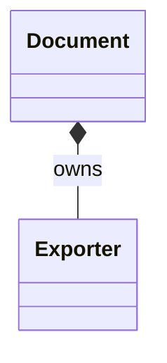
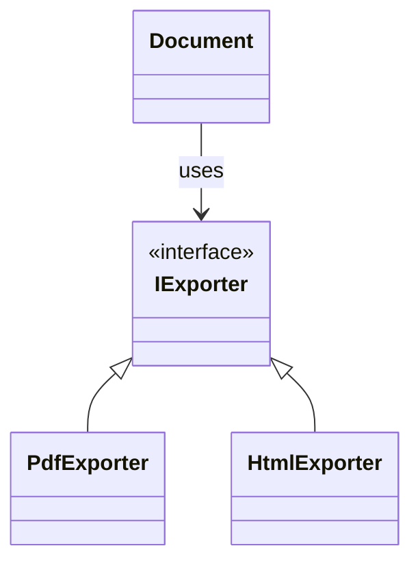
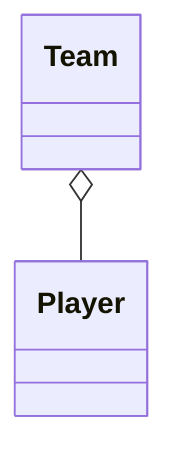
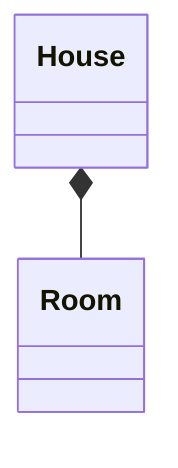

# Composition (Architect-Level Guide)

This document explains **composition** in depth —  
**what it is, how it works, why it exists, and when to use it**.

Composition is one of the most important design concepts in object-oriented systems and is the **default choice** for building flexible, maintainable software.

---

## 1. What is Composition?

### Plain English Definition

> **Composition means building an object by combining other objects,  
> where the object delegates work to its parts instead of inheriting behavior.**

In short:

- The object **does not become** another object
- The object **uses** other objects to do its work

This is called a **HAS-A relationship**.

---

### Examples

- A `Car` **has an** `Engine`
- A `Document` **has an** `Exporter`
- A `Service` **has a** `Logger`
- A `Controller` **has a** `Validator`

None of these are subtypes.  
They are **collaborators**.

---

## 2. Composition vs Inheritance (High-Level)

| Concept | Composition | Inheritance |
|------|-----------|------------|
| Relationship | HAS-A | IS-A |
| Flexibility | High | Low |
| Coupling | Loose | Tight |
| Default choice | ✅ Yes | ❌ No |

> **If you can say HAS-A, do not use inheritance.**

---

## 3. How Composition Works

Composition works by **holding references** to other objects and **delegating behavior** to them.

Conceptually:

```
Document
 ├── Exporter
 ├── Compressor
 └── Encryptor
```

Each part:
- Has a single responsibility
- Can be replaced independently
- Can evolve without breaking others

---

### UML: Composition



The filled diamond (`*--`) indicates **strong composition**.

---

## 4. Why Composition Exists

Composition exists to solve problems that inheritance cannot solve safely.

---

### 4.1 Avoids Class Explosion

Inheritance creates new types for every variation.

Example (bad):

```
EncryptedPdfDocument
CompressedPdfDocument
EncryptedCompressedPdfDocument
```

Composition avoids this by **combining behaviors at runtime**.

---

### 4.2 Avoids Tight Coupling

Inheritance tightly couples child classes to parent implementation.

Composition:
- Keeps classes independent
- Limits change impact
- Makes refactoring safe

---

### 4.3 Enables Runtime Flexibility

With composition:
- Behavior can change at runtime
- Order of behavior can be adjusted
- Features can be optional

Inheritance locks behavior at compile time.

---

## 5. When to Use Composition

Use composition when **any** of the following are true:

- You want to reuse behavior
- You want runtime flexibility
- The relationship is HAS-A
- You want to avoid deep hierarchies
- Behavior may change in the future
- Subtype polymorphism is not required

---

## 6. Composition + Interfaces (Power Combination)

Composition works best when combined with **interfaces (abstract base classes)**.

Example:

```
Document HAS-A Exporter (interface)
```

At runtime:
- Exporter can be PDF, HTML, Markdown
- Document code never changes

This achieves:
- Polymorphism
- Loose coupling
- Open/Closed Principle

---

### UML: Composition with Polymorphism



---

## 7. Aggregation vs Composition

Composition has two related forms.

---

### 7.1 Aggregation (Weak HAS-A)

- Part can exist independently
- Owner does NOT control lifecycle

Example:
- Team aggregates Player



---

### 7.2 Composition (Strong HAS-A)

- Owner controls lifecycle
- Part cannot exist independently

Example:
- House composed of Rooms



---

## 8. Common Mistakes with Composition

❌ Treating composition as inheritance  
❌ Creating circular dependencies  
❌ Letting components know too much about their owner  
❌ Using composition but still branching with `if-else`  
❌ Overengineering with too many tiny objects  

---

## 9. Composition and Memory (C++ Perspective)

Composition works with:
- Stack allocation (preferred)
- Heap allocation (when lifetime must be dynamic)

Important rule:

> **Heap is about lifetime, not polymorphism.**

Use `std::unique_ptr` when:
- Object lifetime is owned
- Object is created at runtime
- Ownership must be explicit

---

## 10. Final Mental Models (Memorize These)

- Composition builds behavior by assembling objects
- Composition models collaboration, not identity
- Composition avoids inheritance traps
- Composition is the default design choice
- Inheritance is the exception

---

## One Sentence to Never Forget

> **Composition builds behavior without committing to a type hierarchy.**

If you understand this document, you understand modern object-oriented design.
