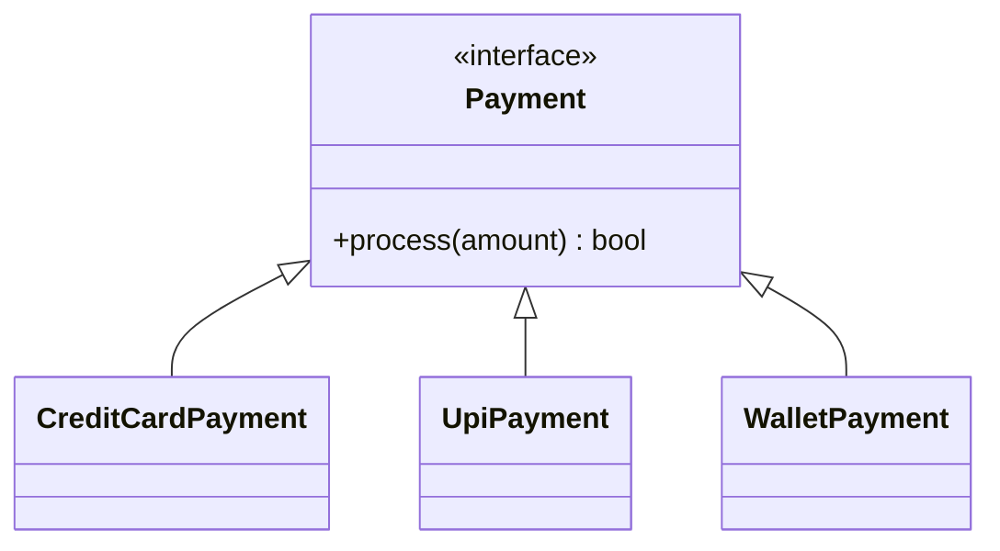
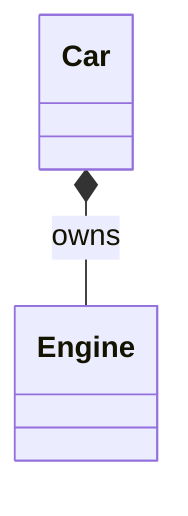
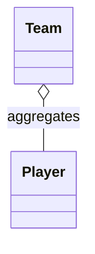

# Inheritance and Composition (Architect-Level Guide)

This README is structured deliberately to avoid confusion.

1. **Inheritance — what it is, why it exists, when it is correct**
2. **Composition — what it is, why it is preferred, when to use it**
3. **Why both exist and how to choose correctly**

Each concept is explained **in isolation first**, then connected.

---

# 1. INHERITANCE

## 1.1 What Inheritance Really Is

Inheritance is a **type relationship**, not a code-sharing mechanism.

When class `B` inherits from class `A`, it means:

> **B is a subtype of A and can replace A everywhere safely**

This is called **Subtype Polymorphism**.

Inheritance exists to support this — nothing else.

---

## 1.2 The Only Valid Reasons for Inheritance

Inheritance is allowed **ONLY when both conditions apply**:

1. **Subtype polymorphism is required**
2. **Hierarchical code reuse is safe and intentional**

If either condition is missing → inheritance is incorrect.

---

## 1.3 Subtype Polymorphism (Core of Inheritance)

### Definition (Plain English)

> Code written for a base type must continue to work correctly  
> when any subtype is substituted — without knowing which subtype it is.

This is governed by **Liskov Substitution Principle (LSP)**.

Example:
Parent type: Payment

Assumptions:
Can charge an amount
Will either succeed or fail
Leaves system in a consistent state

Subtypes:
CreditCardPayment
UpiPayment
WalletPayment

If a system says:
“Process payment and continue order”
Then any subtype must obey that expectation.

If one subtype:
Throws unexpected exceptions
Requires extra steps
Delays indefinitely
Breaks transactional assumptions
---

## 1.4 Behavioral Contract

A subtype must:
- NOT strengthen preconditions
- NOT weaken postconditions
- NOT break invariants

Inheritance is about **preserving promises**, not changing them.

---

## 1.5 UML: Proper Inheritance (Correct Design)

---

## 1.6 Interface Inheritance vs Base Class Inheritance

### Interface Inheritance (Safe)
- Only behavior contracts
- No shared state
- No shared logic
- Used purely for polymorphism

### Implementation Inheritance (Risky)
- Shared state
- Shared behavior
- Tight coupling
- Parent changes affect children

> **Interfaces define WHAT, base classes define HOW**

---

## 1.7 When NOT to Use Inheritance

Do NOT use inheritance when:
- You only want code reuse
- Classes are “related by name”
- Behavior differs per subtype
- HAS-A relationship is possible

Inheritance is **irreversible coupling**.

---

# 2. COMPOSITION

## 2.1 What Composition Really Is

Composition models **ownership and behavior delegation**.

Instead of saying:
> “I am this thing”

Composition says:
> “I have this thing and use it”

---

## 2.2 HAS-A Relationship

Composition represents a **HAS-A** relationship.

Examples:
- Car **has an** Engine
- Order **has a** PaymentMethod
- Service **has a** Logger

---

## 2.3 UML: Composition (Strong HAS-A)

---

## 2.4 Aggregation (Weak Composition)

---

## 2.5 Why Composition Is Preferred

Composition provides:
- Loose coupling
- Runtime flexibility
- Easier testing
- Safe refactoring
- No hierarchy lock-in

---

# 3. WHY BOTH INHERITANCE AND COMPOSITION EXIST

## 3.1 They Solve Different Problems

| Problem | Tool |
|------|------|
| Type substitutability | Inheritance |
| Behavior flexibility | Composition |
| Code reuse | Composition |
| Open/Closed Principle | Both |

---

## 3.2 Decision Rule (Architect Rule)

Ask these questions **in order**:

1. Do I need polymorphism?
2. Is this a true subtype?
3. Is behavior fully compatible?
4. Is shared behavior stable?

Only if ALL are YES → use inheritance.

---

## 3.3 Inheritance vs Composition (Side-by-Side)

| Aspect | Inheritance | Composition |
|----|----|----|
| Coupling | Tight | Loose |
| Flexibility | Low | High |
| Refactoring | Hard | Easy |
| Runtime change | No | Yes |

---

## One Sentence to Never Forget

> **Inheritance is about what an object can safely replace.  
> Composition is about what an object can safely use.**

Remember these sentences:

Inheritance is about what an object IS
Composition is about what an object USES

Inheritance models identity
Composition models collaboration

Use inheritance rarely and deliberately
Use composition by default